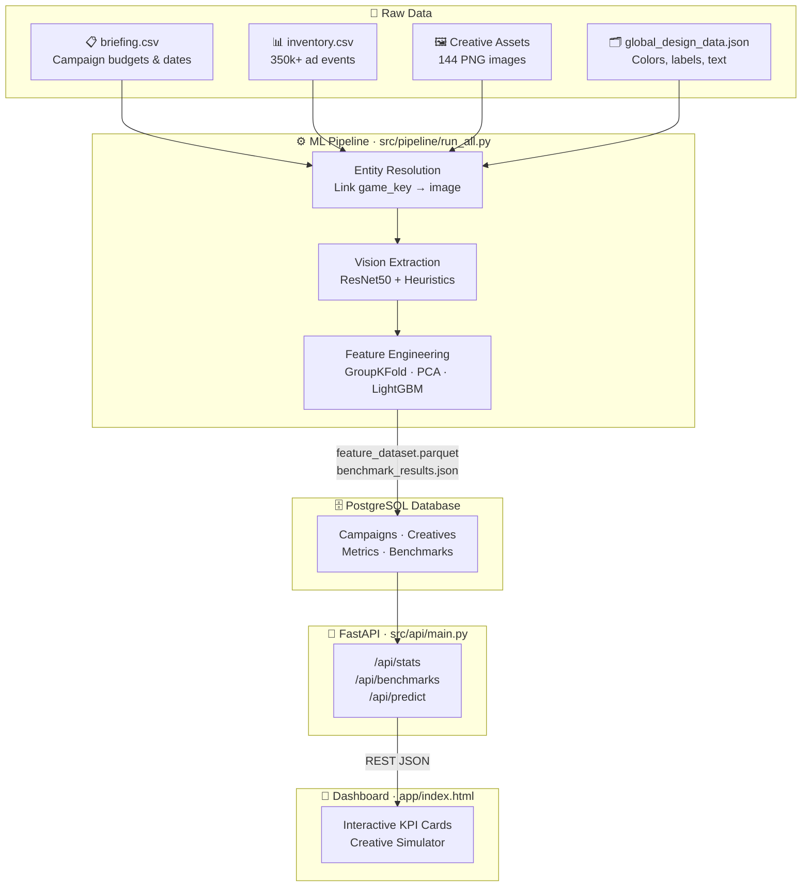

# Ad-Challenge: Multimodal AdTech Creative Performance Prediction
[](https://github.com/bkget/Ad-Challenge/actions/workflows/ci.yml)
This project is an end-to-end Machine Learning and Data Engineering platform built to predict the performance of digital advertising creatives *before* they are launched. 

It transforms raw campaign logs, tabular metadata, and actual image pixels (using deep learning) into a unified PostgreSQL database, serves the insights via a FastAPI backend, and visualizes them on a dynamic, interactive dashboard.

---

## 1. The Basics: Understanding Ad Analysis

### The Problem
When a brand (like Lexus or IHOP) runs a digital ad campaign, they spend thousands of dollars showing image ads to users on phones and computers. They want to know: **Which image will get the most clicks and engagement?** Normally, they have to spend money to test the ads live (A/B testing). 

### The Solution
We use Machine Learning to look at historical data and predict the future. We want our AI to say: *"Based on the budget, the target country, and the fact that this image is highly colorful and has a video component, we predict an Engagement Rate of 14%."*

### Key Concepts
*   **Impression:** One instance of an ad appearing on a user's screen.
*   **Engagement / Click:** When the user interacts with or clicks the ad.
*   **Engagement Rate (ER) & Click-Through Rate (CTR):** The metrics we are trying to predict. (e.g., 100 impressions and 5 clicks = 5% CTR).
*   **Contextual Features:** The environment of the ad (e.g., User is on an iPhone, in the USA, and the campaign budget is $10k).
*   **Visual Features:** The actual pixels of the ad (e.g., Is the image bright? Is it colorful? What objects are in the image?).

Our approach is **Multimodal**, meaning we combine *Contextual* (text/numbers) and *Visual* (images) data together to make a much smarter prediction than using just one type of data.

---

## 2. Overall Architecture Flow

The system is built as a modern, decoupled 4-layer architecture:



### The Flow:
1.  **Pipeline (`src/pipeline/run_all.py`):** Resolves messy entity links, extracts ResNet50 vision features, engineers all features, and trains LightGBM — saving results to `.parquet` and `.json` caches.
2.  **Database Loader (`src/db/load.py`):** Reads those caches and loads them cleanly into a relational PostgreSQL database.
3.  **Backend API (`src/api/main.py`):** Connects to the database and exposes `/api/stats`, `/api/benchmarks`, and `/api/predict` endpoints.
4.  **Frontend Dashboard (`app/index.html`):** Fetches live data from the API and renders an interactive Creative Performance Simulator.

---

## 3. Key Technical Decisions & Framework Choices

Why did we choose these specific tools from the vast sea of available options?

### A. Machine Learning Model: LightGBM vs. XGBoost / Random Forest
*   **Decision:** LightGBM.
*   **Why?** Tree-based models dominate tabular data. LightGBM handles categorical variables (like `device_type` or `geo_country`) natively without needing massive One-Hot Encoding arrays. It is significantly faster to train than XGBoost and handles missing data gracefully. 
*   **Evaluation:** We used **GroupKFold** cross-validation grouped by `campaign_id`. This is critical: standard splitting would leak data (the model would memorize campaigns). GroupKFold forces the model to predict on *entirely unseen campaigns*, proving it actually learned generalizable patterns.

### B. Computer Vision: ResNet50 vs. CLIP vs. Basic OpenCV
*   **Decision:** ResNet50 (Deep Learning) + OpenCV heuristics.
*   **Why?** While OpenAI's CLIP is the state-of-the-art for image-text matching, it is heavy and requires a GPU. ResNet50 is lightweight enough to run on a standard CPU laptop. We pass the ad images through ResNet50 to get a 2048-dimension vector, then use **PCA (Principal Component Analysis)** to compress it down to 32 dimensions so the LightGBM model isn't overwhelmed. We also combined this with standard heuristics (Brightness, Saturation, Entropy) which are highly interpretable for clients.

### C. Backend API: FastAPI vs. Flask / Django
*   **Decision:** FastAPI.
*   **Why?** Django is too heavy for a simple data-serving layer. Flask is classic but synchronous by default. FastAPI provides automatic data validation (via Pydantic), is extremely fast, and requires minimal boilerplate to spin up a robust JSON API.

### D. Database: PostgreSQL vs. MongoDB / SQLite
*   **Decision:** PostgreSQL.
*   **Why?** Advertising data is highly relational (Campaigns -> Creatives -> Impressions). While MongoDB handles unstructured JSON well, predicting metrics requires strict schema enforcement and aggregations, which SQL does perfectly. SQLite is great for prototypes, but PostgreSQL proves production readiness and integrates perfectly with Docker.

---

## 4. How to Run the Project

You can run this project completely locally (Option A) or using Docker (Option B).

### Prerequisites
*   Python 3.11+
*   *(Option A)* A local PostgreSQL server running on port 5432 with credentials `postgres` / `postgres`.
*   *(Option B)* Docker Desktop installed and running.

### First: Install Dependencies (For Both Options)
Open your terminal in the project root and run:
```bash
python -m venv venv
# Windows: venv\Scripts\activate
# Mac/Linux: source venv/bin/activate

python -m pip install -r requirements.txt
```

---

### Option A: Running Without Docker (Native Local)

**Step 1: Run the ML Pipeline**
Extract features and train the models.
```bash
python -m src.pipeline.run_all --force
```

**Step 2: Initialize Database and Load Data**
Assuming you have a local Postgres running on `localhost:5432`:
```bash
# Create the Ad-DB database
python scripts/init_db.py

# Load the ML data into the database
python -m src.db.load
```

**Step 3: Start the Backend API**
```bash
python -m uvicorn src.api.main:app --port 8000
```

**Step 4: View the Dashboard**
Keep the terminal from Step 3 running. Open a file explorer, navigate to the `app/` folder, and double click `index.html` to open it in your web browser.

---

### Option B: Running With Docker (Production-Like)

Docker packages the database and the API into isolated containers so you don't have to install PostgreSQL directly on your machine.

**Step 1: Spin up the Infrastructure**
```bash
# This downloads Postgres, builds the FastAPI image, and starts both in the background
docker-compose up -d --build
```

**Step 2: Run the ML Pipeline (Locally)**
You still run the heavy ML lifting on your local machine to generate the feature datasets.
```bash
python -m src.pipeline.run_all --force
```

**Step 3: Load Data into the Docker Database**
Push your generated data into the newly running Docker PostgreSQL container.
```bash
python -m src.db.load
```

**Step 4: View the Dashboard**
Your API is running inside Docker on port 8000. Open `app/index.html` in your web browser. 

*To shut everything down later:* `docker-compose down`

---

## 5. How to Interact with the Project

Once the Dashboard (`app/index.html`) is open, here is how you interact with it and understand the results:

1.  **The Hero KPIs:** Notice the top numbers. The platform successfully linked hundreds of thousands of events to their exact creative image assets.
2.  **The Benchmark Chart:** This is the core scientific result. Click the "R² Score" button. You will see that the `Tabular` model (context only) performs decently, but the `Multimodal` model (context + image pixels) performs significantly better (a ~19% relative jump). This proves that **visual aesthetics drive engagement**.
3.  **Feature Importance:** Look at the purple and teal bars. This explains *how* the AI makes decisions. Campaign parameters (like budget and duration) are the strongest drivers, but visual elements like image brightness and deep ResNet features are right behind them.
4.  **The Creative Performance Simulator:** Scroll to the bottom. Change the sliders (e.g., increase Brightness, switch Device to Smartphone, toggle Video on). Watch the Predicted ER and CTR update instantly. **This is hitting the FastAPI backend in real-time**, proving the architecture works end-to-end. 

For static analysis charts (perfect for slide decks), check the `results/charts/` folder after running the pipeline!
